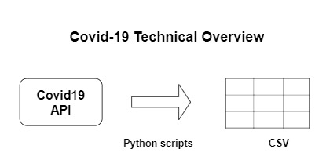
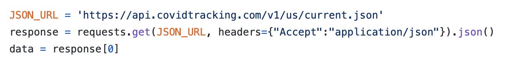
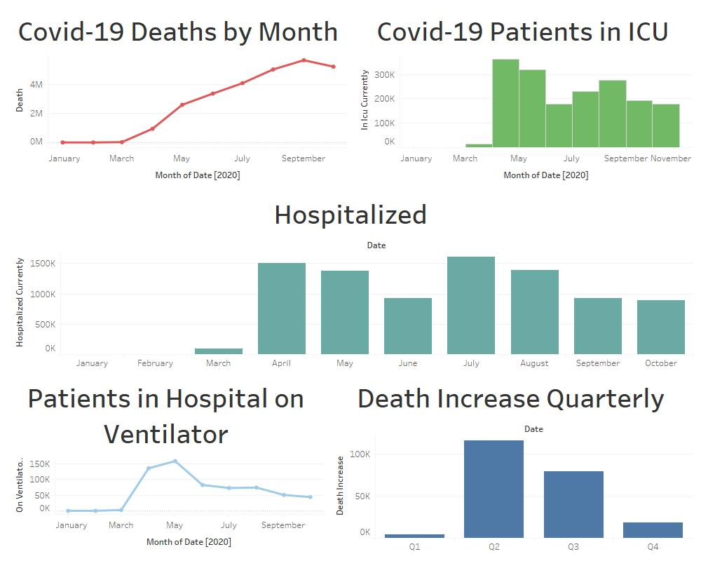
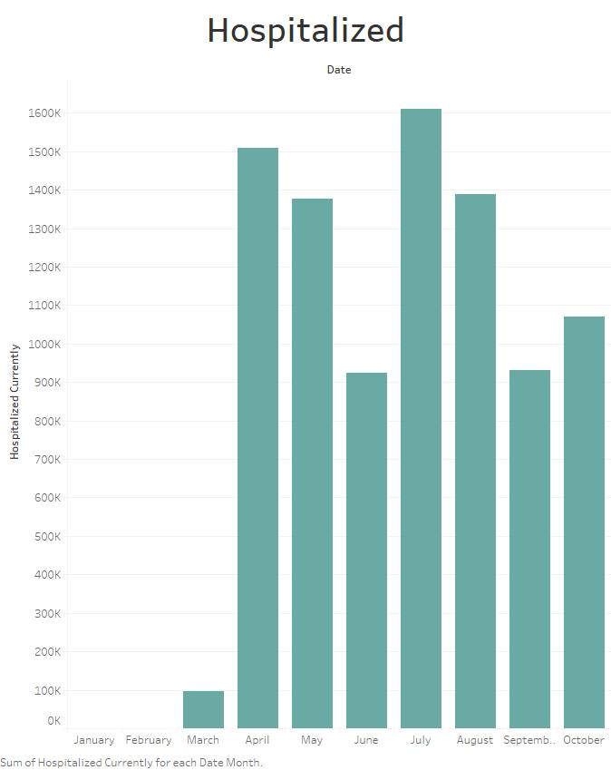
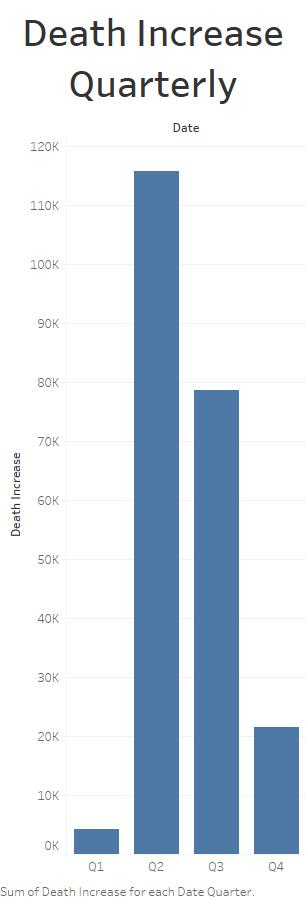

---

Living your best life in the wake of Covid-19 has been a challenge, to say the least. It has affected my productivity, family, friends, and more. Please, wear a mask, wash your hands, and practice social distancing. 

Tracking all of the organizations that report this information has also been a challenge. Which channel do you trust? Certainly, not some dude whos only made one dataset on Kaggle. But, why not. I wanted to find out how to track this information for myself and turn it into a cool little project for the community because I could not find many solid tutorials on building a dataset. So I wanted to go about it simply and show how you too, can be a dope scientist/analyst. 

In this post, we are working with JSON, which stands for Javascript Object Notation, and CSV, which means comma-separated-values, another variation of a text file. There are many ways that I could access the API’s information, but to make it simple, mapping structured JSON information into a relational CSV seemed to do the trick- especially for the amount of data the API provides ( we are currently at ~290 rows ). 

## A Note on Data 📝

All of the data compiled comes directly from the Covid19 Tracking Project. This organization compiles its information daily from local municipalities, public health authorities, both state and national. Where data is missing it’s interpolated based on press conferences made by governors or other health authorities. They are currently accepting volunteers to help get more data and are pushing for more transparency from state authorities. ( I volunteered, so should you 😉 ). A few rows were missing at the beginning of the CSV and this might be because this API tracked from January 22nd, while a lot of information had not yet been available. I substituted 0’s from January 22nd - March 31st in the categories positive through onVentilatorCurrenltly because there were missing values. Also, zip code level data is not available consistently, so it is not offered here. Accuracy and context are valued over speed. 

## Steps in the mini Data Pipeline:
1. Python script retrieves data from the Covid Tracking Project via their API and stores the data in a CSV file.
2. Automate the process
3. Dope visualizations!

### The Process 

### 0) Finding the Data API

Searching for the right API to use was a daunting task because there were plenty out there and available. The Cocid19 Data API suits my preferences because they were transparent about how the data is collected and human hands helping prepare the data. Each day between 5 p.m. - 7:30 p.m. I love seeing humans involved in the process of verifying information. Despite the routing of all Covid19 information to the White House, they are still cross-referencing sources. National and Academic. Which is important to us. 
 

### 1) Retrieving the Data 

The Covid Data API is a standard RESTful API that doesn't require authentication at the moment. The calls to retrieve the information ended up being more simple than I thought:

Once the JSON has been converted into a python dictionary we have a workable object to manipulate. Luckily enough updating the CSV was not as challenging either as this code updates each row. View the full code here:

### 2) Automating the Process

Upon making the script work, I then addressed the issue of having the application update without my intervention. The goal was to find a service as opposed to coding out a scheduler. The reason for this was because I wanted to get to pulling the data more quickly. Python anywhere website was the best low-cost option for me. It can run scripts to automate tasks as well as web apps and more. It’s $5 a month and does an amazing job, with log documentation! 

### 3) Dope Visualizations!

Ready for a visualization walk-through? Let's start with Deaths By Month:

Each month before March, we did see patients with symptoms similar to that of the flu. The Stay-At-Home orders weren't announced until March 31st. Naturally, organizations and people were not following the orders, so the rise continued, and ultimately spiked on May 11th at 2.5 million when the stay-at-home orders were lifted, at least in Illinois/Indiana. 

For those hospitalized, the patient count went from about 100 thousand in March to well over 1.5 million. The hospitals in the country were at capacity as the virus continued to spread. Many people who haven't even tested positive for covid did come in and have symptoms so we are not sure if it's the most accurate number to go in because this also includes false-positive results plus more. 

Multiple quarters have passed since the stay-at-home orders were issued they have been repealed multiple times. The increase from the first quarter rose to 115k deaths. From the second quarter to the third, we saw a decrease in death to 78k deaths. Then in the fourth quarter, The data is showing that death is at 22k for historical. I believe this number is skewed because multiple news outlets are reporting numbers of over 100k DAILY, and this data was last collected/refreshed in September when this blog post was first released. 

### Conclusion

Since then the nation has been wavering with growing positive cases, hospitalizations, and deaths. Now we are at the point where there are 100,000 cases reported daily. Hospitals are crowded and there are about 6 million deaths total and appearing to rise. We are looking towards another shutdown and I encourage people to wear their masks, wash their hands, and follow the instructions. 

Again returning to the confusion of the sources and who to trust and how to track, the only thing I can rely on is my ability to trust what I value and seek the information in ways that matter to me. Because of all the confusion, this helps me measure what's going on for myself - and no one data source is absolute or the end-all, be-all. So I use this along with sources I trust to predict, track, and measure what's going on outside because my couch has become so comfortable 😀. 

Please see the full code at my [Github](https://github.com/Gilb03/Covid19Project)
