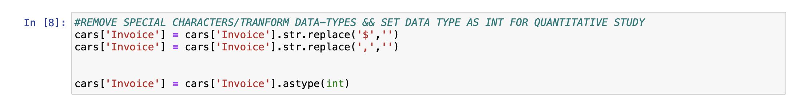

# What and Why

`Exploratory Data Analysis` 🔭 is seeking trends or interesting information about how data relates to a goal. `Data` are facts/records and statistics collected for reference or analysis. 

Essentially, this is a `scientific method`. A particular challenge is to translate qualitative into quantitative data. Because most of the data comes in as text, so what is meaningful and how can it be encoded numerically. 

Business goals 📈 for sales data trends or social media activity analysis could be interesting to study by using these methods. What are some subjects you're passionate about? Check out some datasets [here](https://github.com/veb-101/Data-Science-Projects). The important thing to know about this tutorial is that you can use it for different datasets🤩. In this tutorial we will be using a python library called pandas, and matplotlib/plotly for visualizations. This is staged to do statistics, so I've included some of the libraries necessary to do so( it'll be a follow up 🙂) . 

The 3 step method consists of separating analysis into 3 different code blocks organized around completing one goal each. Each block can have about 5 individual lines of code which either explore, tranform, or visualize the data you are in charge of understanding and presenting. 
* Import, clean and output data
* Perform descriptive statistics 
* Create dope visualizations

This helps when trying not to cram too many lines of code into one block and it also helps when it comes to *debugging*. 

# The How
🤔🤔🤔

We will be using the car data from kaggle to analyze automobile information based on these categories listed below. 

# Tutorial
*Set up jupyter notebooks* [here](https://jupyter.org/install)
* Install anaconda from [here](https://www.anaconda.com/products/individual) for mac, for windows, and linux.
* Open navigator 
* Launch jupyter notebook 

1. import stats.model && sci-kit learn

Code block 1: Each block should consist of about 5 lines of analysis code. This means one line produces one graph or insight. The first line of code within a block should be reading the data into a variable using the read_csv module from pandas. 

An example of this would be 1 line to read in the data, and then 4 lines to gather any other information about the data in its current state. 

Above is one of the lines that should be top of mind when it comes to seeing what the data types are at first. Here are some other common exploratory analysis commands include `.shape`, `.info()`, `.head()`, `.describe()`, and `.tail()`. 

Code block 2 : This block of code is to `clean` the data. Essentially that means we have to convert some varaiables into quantitative form, because if it stayed qualitative it would be much harder to draw any insight from. We will be removing fields we might not need.

 

Using pandsas we will convert the data types from strings to integers. so that we can do some descriptive statistics. 

Code block 3:
This block of 5 lines of code will have visualizations. The goal in this block is to create and choose several of the most meaningful visualizations to include in whatever report you have to do. 

I've usually taken most of the visualizations to the presentation just in case , especially if they are of any interest. The goal of 5 lines for visualizations is high level at best, and recommended so that we prioritize visualizations.Remember this is a conceptual idea of how to organize the analysis of data using python. Here is the link to the [code](https://github.com/Gilb03/eda-tutorial)

